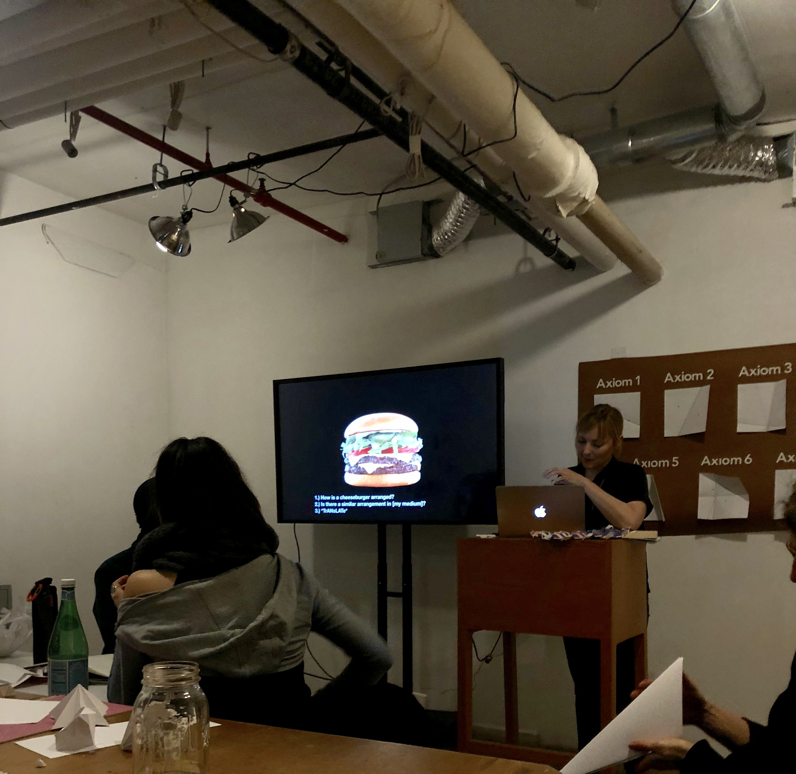
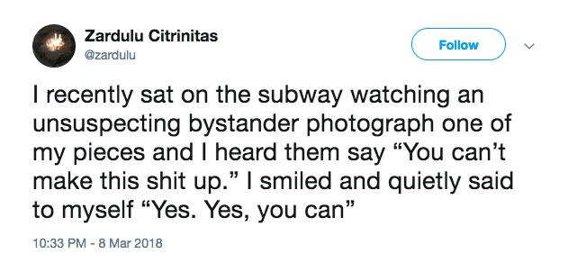
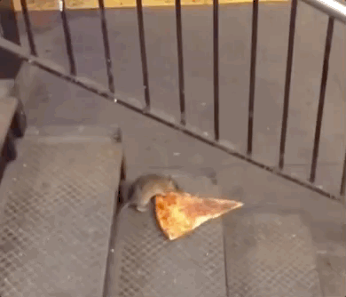
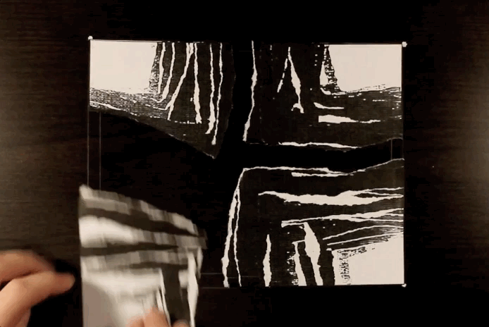
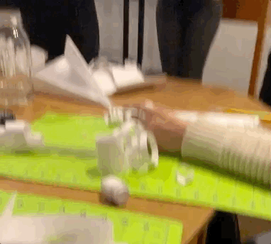
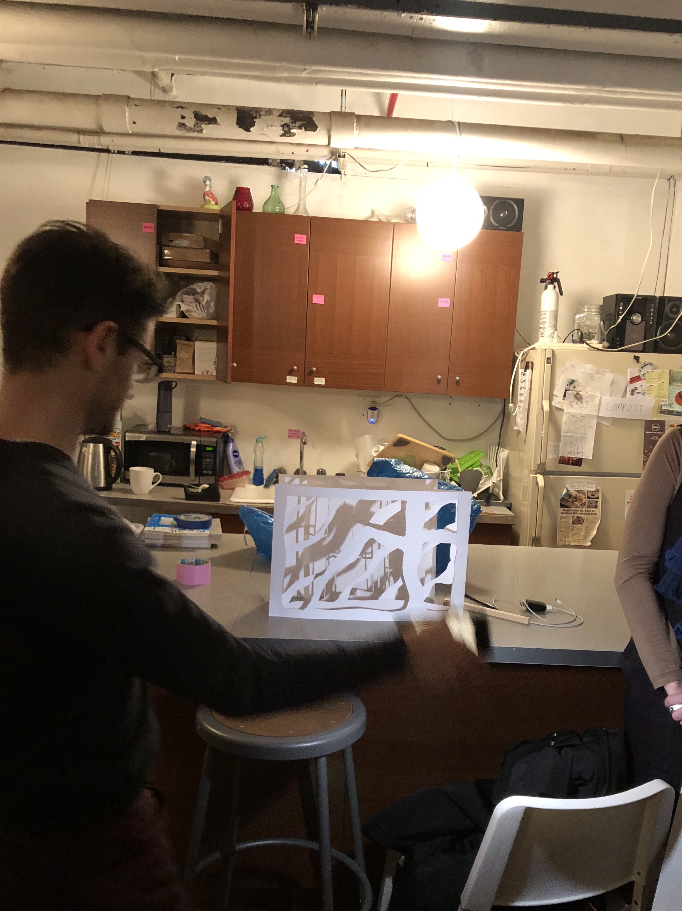

# Code Societies 

### Paper as an Interface on the world, Paper Gadgets

Wednesday, Feb. 6 • Class 3 
Kelli Anderson

_When tech is made physical it becomes radically accessible. In this class, we will discuss a multitude of wants that paper can make difficult abstractions tangible and help us observe the delicate physical forces of the world around us_.

In today's class, we discussed what it means to program something and how we are able to embed it with meaning. We also talked about how to look at something, even something unassuming and bland, and to unpack it, how to question its meaning and drive at the integral nature of the object in question.

 |  
:-----------------------------:|
Answering big questions

Laying the groundwork for today's class we read [Bret Victor's](http://worrydream.com/cv/) ["Kill Math"](http://worrydream.com/KillMath/) and Kenya Hara's [dialogue](http://www.takeo.co.jp/en/news/detail/000909.html) with mathematician Masao Morita on the Takeo Paper Show, [SUBTLE](https://www.ndc.co.jp/hara/en/works/2018/04/subtle2018.html). Both of these touched on the idea that paper is often the medium through which human thought has historically been communicated. In SUBTLE, Morita mentions Richard Feynman rejecting the idea that the paper is simply the medium. "Its working," it is essentially operating as the extension of the body and the thought process. The paper allows for the performance of the thought process, rather than act as a record of it. "Kill Math" in particular inspired a lot of conversation about the systems and the nature of symbolic languages. From this set of readings we were also able see some of the ways that both artists and designers as well as scientists and engineers investigate their materials.

#### Programming Analog Environments

People are quicker to assume that a digital experience is programmed by a human. In an analog environment, people react to a physical space or experience with more trust. It's easy to assume that the space is a given and forget the intentionality it has been programmed with, or it's makeability.

Makeability per [Experimental Jetset](https://www.experimentaljetset.nl/archive/design-ideology):

>After all, the notion of design is intrinsically linked to the ideology of 'makeability': the idea that we are living in a world that can be understood by people, interpreted by people, and thus can also be consciously shaped by people.

Everything is programmable and everything holds an inner complexity. By studying the structure and the rules of what is programmed, we can start to reveal those inner complexities in order to tap into them or extract further meaning. 

We used an exploration of Khaki to demonstrate the meanings and histories embedded in an object/symbol/color. We first questioned our initial associations to the word (fraternities, dirt, Gap commercials, casual Fridays). We continued to extract meaning and associations until we pieced it back to adventuring and exploration and then further back to British colonists where both the color and the fabric served a practical purpose. A quick read on khakis as the "invisible outfit" having been sold as adventure-adjacent: [Colors/Khaki](http://www.cabinetmagazine.org/issues/13/khaki.php) by Ben Marcus. (The tldr version would be [Colors/Cerulean](https://www.youtube.com/watch?v=vL-KQij0I8I) by Miranda Priestly.)

By examining the hidden complexities of khaki--something so seemingly bland and without meaning, we were able to glean additional meanings which help inform our current understanding of khaki. Presumably, by using these same methods of interrogation and extrapolation, we can explore paper the same way.

My favorite example of a programmed, analog experience? Zardulu. She's a performance artist based in New York who plays with the balance between truth and myth. Her work often goes viral (without her name attached), creating new realities and narratives. Kelli showed us the following tweet, which so perfectly captures how people trust their analog environments even when answers might be sitting in front of them. Although not the work shes referencing, its one of her most recognizable.

 |  
:-----------------------------:|:-------------------------:

#### Programming as Control or Collaboration
One of my favorite topics of this class was when we looked at two works of [Johan Rijpma](http://www.johanrijpma.nl/), a contemporary artist based in the Netherlands. He uses simple, relatively mundane subjects in his work, but through his investigation of the materials and the systems that he applies, he is able to provide a new perspective on the materials and their behavior. We examined two of his works in order to demonstrate how we can think of programming as controlling or collaborating with its subject.

In the first piece we looked at, [Division (2012)](https://vimeo.com/42340098), the rules Rijpma applied were easy to recognize. He began with a blank piece of paper, tore it in half, and then again into quarters. The four pieces were slightly spread out from each other creating small channels of black, negative space. This new image was photographed or scanned and finally printed providing the new piece of paper for the process to start again. By repeating this again and again, he creates the illusion of movement on the paper.

  |  
:---------------------------------:|:-------------------------:

The second work by Rijpma we looked at was [Tape Generations (2011)](https://vimeo.com/42340098). Here, Rijpma has partially adhered rolls of tape to the underside of a glass table. We watch as gravity slowly pulls the rolls down, sometimes collecting each other as they cross paths. We can see that this piece also has some programming in that there is an initial pattern and path for the tape to follow. However, unlike Division where the choreography comes from the control and the repetition of the steps, in Tape Generations, the choreography comes from the intrinsic properties of the tape and its interacting with its environment. Here, the programming is acting in collaboration with the tape itself.

#### Approaching Material

In his 1970s essay 'Formative Years' Hannes Beckmann recounts his first day of the Bauhaus Preliminary Course and his memories of what Josef Albers said on that first day.

>All art starts with a material, and therefore we have first to investigate what our material can do.

On this first day Albers had brought in a stack of newspapers as their material. He encouraged experimentation, to explore without the aim of making a product. These initial experimental studies would eventually lead to constructive thinking where the material could become something more than what it started as.

>I want you to respect the material and use it in a way that makes sense &mdash; preserve its inherent characteristics.

We wrapped up by talking about what tools we are able to use in investigating our material. Asking ourselves how we are able to respect the material and pay attention to its own wants and needs.

- Observation: simply noticing and paying attention. "Gravity will pull this tape down."
- Consider what we already know and, per [Kenya Hara](https://www.ndc.co.jp/hara/en/), bring it to the level of consciousness. Object solutions, for example [Nendo](http://www.nendo.jp/en/release/2019/) and their [chopsticks designs](http://www.nendo.jp/en/works/chopsticks-collection-2/rassen/?egenre) provide elegant answers to "bugs" in a product we take as a given &mdash; something not to be improved upon.
- Consider behavior: in paying attention to something, ask what we are doing a disservice to with our inattention.

#### Last But Not Least: An Assignment!

With all this new knowledge and perspective, Kelli sent us out into the world (courtyard/the other room) with the assignment to spend five minutes paying close attention to one thing that we wouldn't typically give our attention, or even notice.

After that we were handed a sheet of paper and tasked with translating what we had been observing to the paper. Or if you wanted to simply investigate the paper independent of the prompt and see what you discover, thats fine too! Choose your own adventure! We saw studies in shadows and obscure details of the space. We also saw experiments that were testing the potential behaviors of the paper by iterating on an idea. Having discussed methods for observing, considering, and approaching the material led to many successful and interesting early experiments.

     

