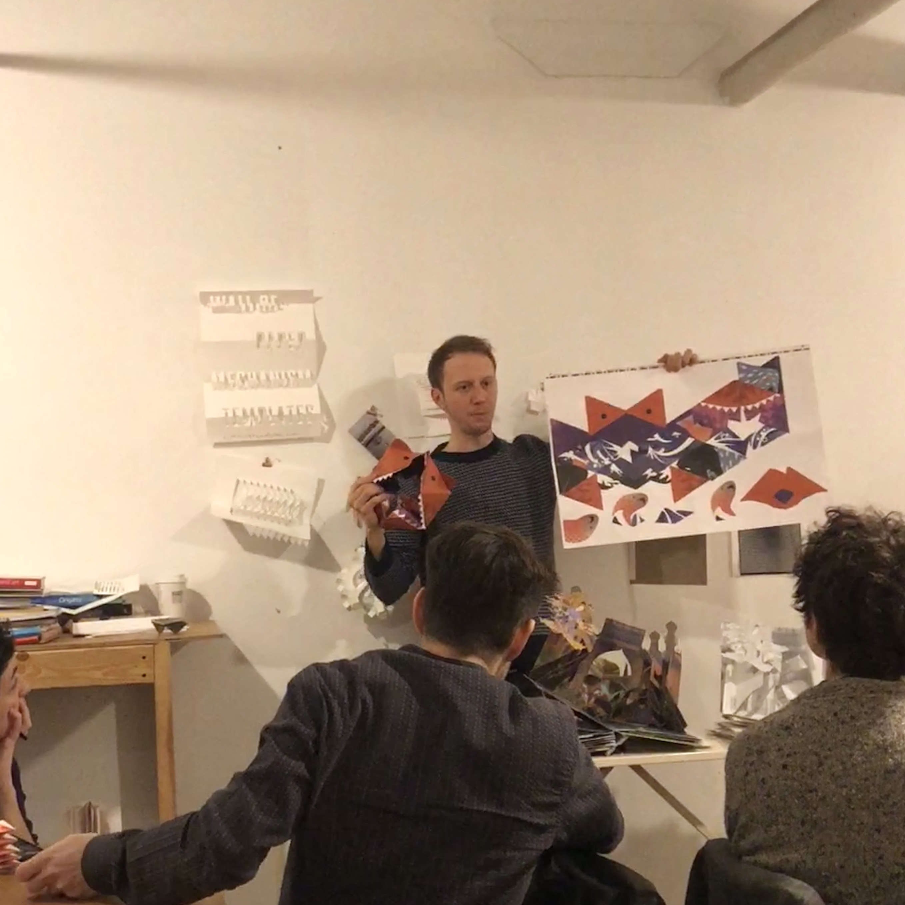
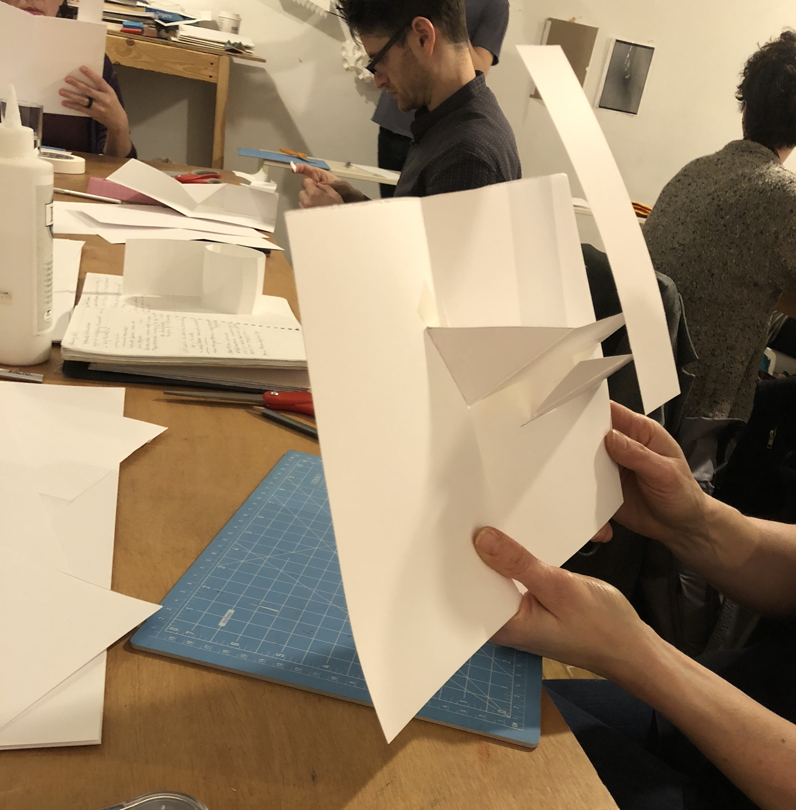
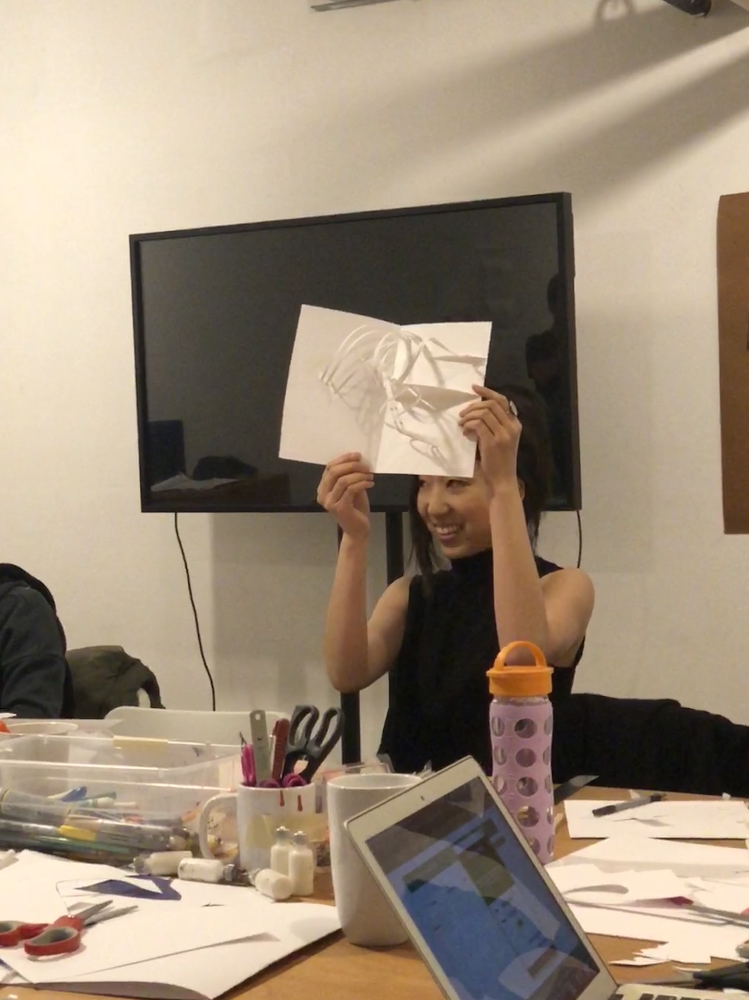
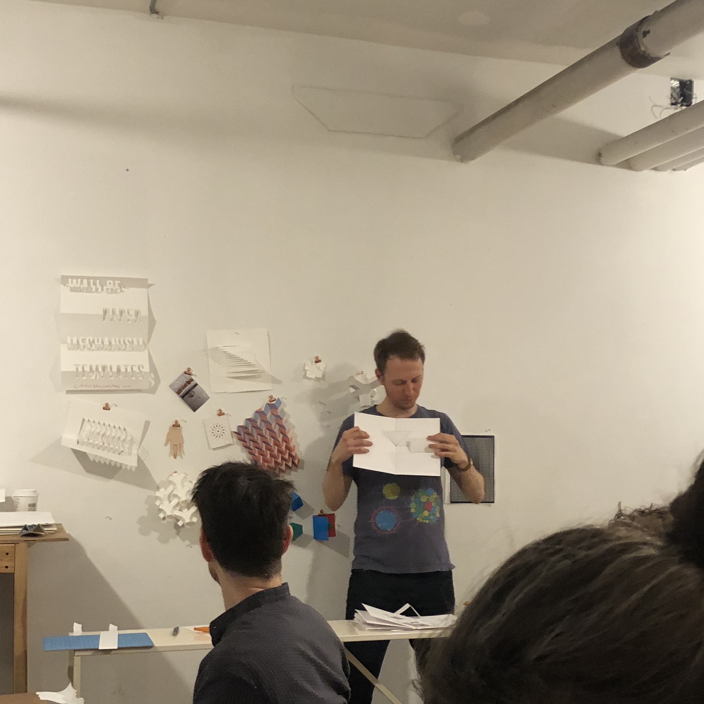
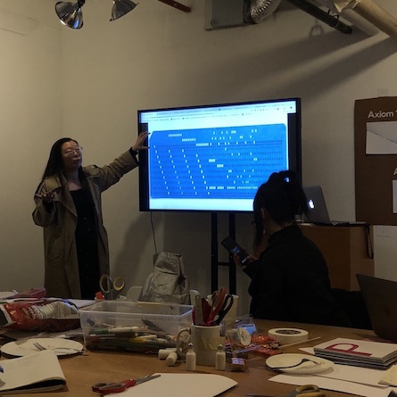
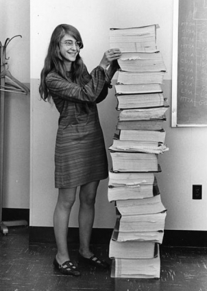

# Code Societies 

###  The Fundamentals of Pop-ups II, The History of Paper and Computers

Friday, Feb. 8 • Class 5 
Simon Arizpe, Pam Liou

_In the second section of Pop-Up Fundamentals, we will explore combinations of the different mechanisms learned at the start of the course. Pam will discuss the history of looms, paper tape, punchcards, and paper computers— and will discuss them in terms of information systems and cybernetics_.

#### Pop-ups II

Today was broken up into two sections, in the first half of class, Simon walked us through what it was like to take a pop up book through the stages of production. We were able to look at some of his published work, like [Zahhak: The Legend of the Serpent King](http://www.simonarizpe.com/thelegendoftheserpentking/). While showing us his work he was able to point out the pop-up elements and techniques we learned in the first half of Pop-Up Fundamentals. He explained the changes he'd make in his book from his rough engineering

 |  
:-----------------------------:|:-------------------------:
Simon showing us the running sheet for The Wild | V-Fold example

Simon also showed us how to make a V Fold Riser. And just like in the previous session, after we learned the basic mechanism, we were able to spend some time exploring ways we could build upon the structure. Throughout the session we were prompted to think of how these pop up elements work and how they might be able to fit the narratives we were telling in our own work.

 |  
:-----------------------------:|:-------------------------:

#### The History of Paper and Computers

In the second half of class, Pam took us through the history of computing and paper, which centers around the paper punch card. 

I was particularly excited for Pam's class since it both 1) aligns with my general interest in the history of fiber arts, and 2) my understanding of how punch cards worked in computing was vague at best! 

N.B. While I am mostly focusing on some of the key points we talked about in the history of punch cards/paper-based computing, I have also compiled a short list of interesting facts and topics which came up in class that are definitely worth noting.

The Jacquard Loom, invented by Joseph-Marie Jacquard in 1804, is considered the first mechanical computer due to the programmable nature of the punch card system. A series punch cards which would be read by the loom. The entire card would represent one row of the weave pattern. The holes in the card would align with specific pins which held individual threads; the holes allow the pin to stay in registration and be lifted. If there is no hole, then the card pushes the pin out of registration and it is not lifted for the row. Like earlier looms and weaving systems, the shuttle is passed in the space between the lifted and non-lifted threads. The combination of lifting threads for each row, and the passing of the shuttle are what create the pattern for the fabric.

The punch cards would be stitched together in loops so that the loom could readily read and advance the pattern. (And then repeat it.) The card was able to hold all the pattern information, and to physically articulate the lifting of individual threads. Lifting individual threads was a major departure from earlier loom patterns where threads needed to be grouped together, resulting in more basic, but manageable patterns. 

(The V&A has a [very helpful video](https://www.youtube.com/watch?v=K6NgMNvK52A) illustrating how the punch cards work with the pins.)

This system of cards was then adapted by Charles Babbage for his Analytical Engine. Ada Lovelace studied the machine thoroughly and could clearly envision the broader applications outside of pure computation. In her extensive notes on the Analytical Machine, she wrote and published a series of steps for how the machine could calculate Bernoulli numbers and then how these steps could be coded into the instructions for the machine. This credits her as the first programmer.

In 1890, Herman Hollerith's Tabulating Machine was used by the US Census to automate their data collection. The machine tallied and sorted punched cards which held census data. Hollerith also invented the automatic card-feed mechanism, a keypunch for punching cards, and a control panel for rewiring tabulating jobs. He later went on to found the Tabulating Machine Company, which became International Business Machines Corporation. IBM introduced the 80 column punch card in 1928 which eventually became the standard card.

 | 
:-----------------------------: |
Pam explaining how a punch card can be coded

Pam explained how the traditional 80 column punch card are broken into zone and digit punching positions, and how different combinations of zone and digit punches created codes for 128 symbols the english alphabet, digits, and various special symbols. 

We also briefly talked about Margaret Hamilton, and her work for the Apollo project. This passage from a [2015 Wired article](https://www.wired.com/2015/10/margaret-hamilton-nasa-apollo/), explains the relationship between the punch card programming and the "seamstresses" who hardwired the computer memory once the program was complete:
>For Hamilton, programming meant punching holes in stacks of punch cards, which would be processed overnight in batches on a giant Honeywell mainframe computer that simulated the Apollo lander’s work. “We had to simulate everything before it flew,” Hamilton remembers. Once the code was solid, it would be shipped off to a nearby Raytheon facility where a group of women, expert seamstresses known to the Apollo program as the “Little Old Ladies,” threaded copper wires through magnetic rings (a wire going through a core was a 1; a wire going around the core was a 0). Forget about RAM or disk drives; on Apollo, memory was literally hardwired and very nearly indestructible.

(I found looking at examples of [Core Rope Memory](https://en.wikipedia.org/wiki/Core_rope_memory) and [Magnetic Core Memory](https://en.wikipedia.org/wiki/Magnetic-core_memory) to be helpful for understanding the work done my the women at Raytheon.)

The above excerpt is fascinating to me because in the creation of both brand new software and hardware, we can see the legacy of weaving in the punch card software as it meets the physical weaving processes in hardwiring the memory. It also unfortunately highlights the minimization of the women at Raytheon and their meticulous and skilled wiring work. 

 | 
:-----------------------------: |
Hamilton and her Apollo program

For as long as punch systems were used in computation, paper provided the perfect medium for punch cards. Paper was consistently affordable, easy to mark with a pencil or punch, readily available, and uniform. Even as the machines evolved and became more powerful and efficient, the paper punch cards remained fairly static. The paper punch cards effectively defined computation until they became obsolete. It's interesting to think about how all computation had such a physical, tangible element to it. Even when calculating something so inaccessible and unthinkable as a moon landing, the program still had a very physical presence. (As evidenced by that photo of Margaret Hamilton!) 

**More Cool Stuff!**
* Museum of Chinese in America currently has an exhibition, "[Radical Machines: Chinese in the Information Age](https://www.mocanyc.org/exhibitions/radical_machines)" which has a collection of early Chinese typewriters and computers. It's open through March 24, 2019!
* Early terminals had an 80 character limit as an homage/compatibility to the 80 column punch card.
* [4 New York Plaza](https://ephemeralnewyork.wordpress.com/tag/4-new-york-plaza/), designed by Carson, Lundin & Shaw in 1969, was inspired by the 80 column punch card.
* We looked at additional examples of mechanical computing such as the [Pascaline](https://www.britannica.com/technology/Pascaline) and systems that combine electricity and mechanical logic like [light chasers](https://www.youtube.com/watch?v=4LlN_kOmddg).
* Pam has created a [desktop Jacquard Loom](http://pamelaliou.com/doti.html)!
* Examples of data storage/transfer systems: 
  * [Micronesian Star Charts](https://www.nationalgeographic.org/media/micronesian-stick-chart/), provide navigational information to sailors
  * [Incan Quipus](https://www.atlasobscura.com/articles/khipus-inca-empire-harvard-university-colonialism), act as census records
  * [Chinese Military Documents](https://en.wikipedia.org/wiki/History_of_paper#Techniques) depict a map on the earliest known example of paper, c179 BCE.
* Dale Fisk [wrote an account](http://www.columbia.edu/cu/computinghistory/fisk.pdf) of learning to program punch cards at IBM in the 1970s, and being a programmer as they transitioned away from punch cards.
